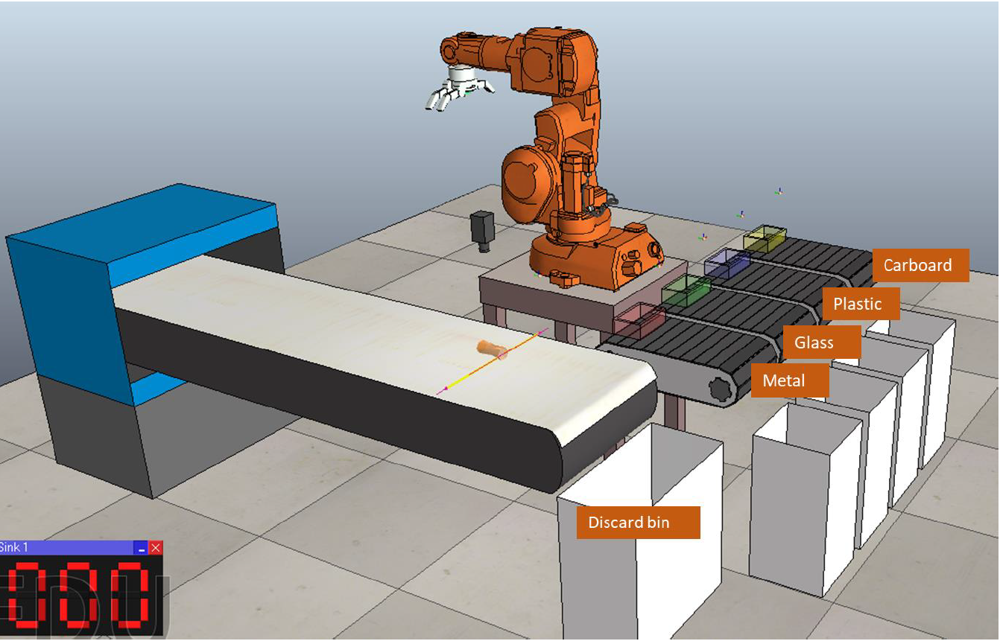

# Laboratory 5 Machine Learning and Artificial Intelligence

## Robot waste recycling system

In laboratory 5, we will study the use of convolutional neural networks to assist the operation of a robot waste recycling system. The main operation of the robot system is to sort objects distributed on a conveyor belt into suitable categories for proper material recycling.
In this laboratory, a camera system will be utilized to capture an image of an object on the conveyor belt and a convolutional neural network will be used to classify such object in one of 4 classes (cardboard, plastic, glass and metal). The classification of a neural network for a given object will be used to trigger a robot command to pick up the object from the conveyor belt and move it to the correct bin.

Convolutional neural networks in robotic simulation with coppeliaSim (v-rep)
